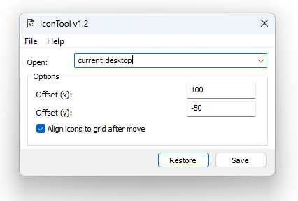

# PersistentDesktopIcons

Small and lightweight (~12kb) win32 application to store the current positions of your desktop icons in a file and restore them from there whenever you like.
Links to *msvcrt* to generate a minimal binary without requiring an additional c-runtime (CRT) installed.
Positions of desktop icons are stored in a INI file with the program name as the key and the X and Y position as values.
Icons where no position is stored in the file are not touched.

***___Application interface___***

While restoring, the snap to grid feature is temporarily disabled to better move the icons around without them getting moved around when two are at the same position.

## How it works

The icons on the desktop are implemented as a [ListView](https://learn.microsoft.com/en-us/windows/win32/controls/list-view-controls-overview) (specifically icon view) control component.
After finding the right window and getting a handle to this listview, querying the positions and moving icons around becomes trivial.